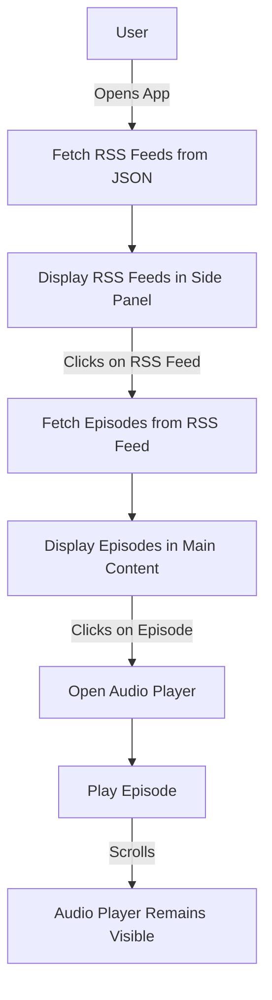
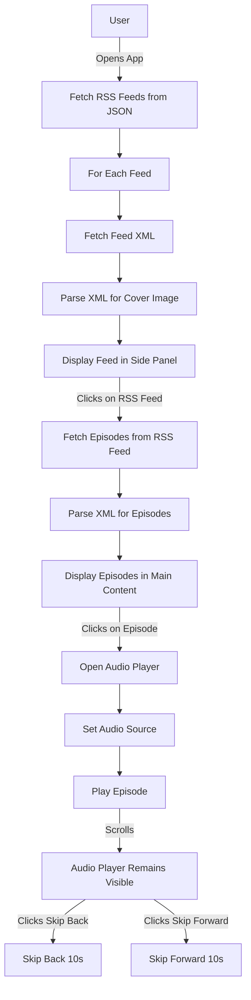

# Podcast Player PWA

This project is a Progressive Web App (PWA) for playing podcast episodes. It dynamically loads RSS feeds, displays podcast episodes, and allows users to play episodes with an embedded audio player.

## Features

- Displays a list of RSS feeds with cover images.
- Fetches and displays podcast episodes from selected RSS feeds.
- Embedded audio player that remains visible when scrolling.
- Handles different XML tags for episode durations.

## Application Flow

### Logical View



### Deep Dive View



## Installation

1. Clone the repository.

```bash
git clone https://github.com/yourusername/podcast-player-pwa.git
```

2. Navigate to the project directory.

```bash
cd podcast-player-pwa
```

3. Start a local server to serve the files. You can use Python's built-in server or any other method.

```bash
python -m http.server 8000
```

4. Open your browser and navigate to http://localhost:8000.

## Usage

1. Open the app in your browser.
2. Select an RSS feed from the side panel.
3. Browse the list of episodes displayed in the main content area.
4. Click on an episode to start playing it in the audio player.
5. Use the skip buttons to move forward or backward in the episode.

## Code Structure

- `index.html`: Main HTML file containing the structure of the app.
- `styles.css`: CSS file for styling the app.
- `app.js`: JavaScript file containing the logic for fetching and displaying RSS feeds and episodes, and controlling the audio player.
- `rss-feeds.json`: JSON file containing the list of RSS feeds and their cover images.
- `service-worker.js`: Service worker file for offline support.

## Known Issues

- CORS issues may arise when fetching certain RSS feeds. Consider using a CORS proxy or server-side fetching if needed.

## License

This project is licensed under the MIT License.
